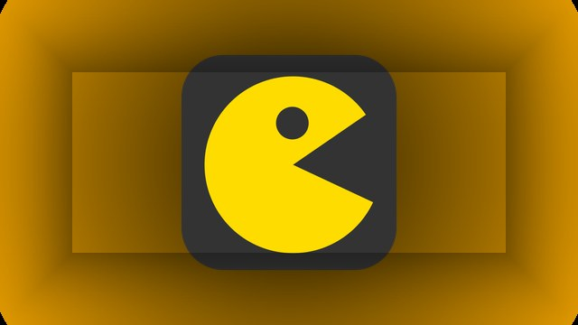

# Arcade Dock

A local game launcher that runs **10 HTML5 games** from one hub in your browser.



## Games

| Game | Genre |
|------|-------|
| Gravity Ball Escape | Puzzle |
| BreakLock | Puzzle |
| Hover Craft | Racing |
| Hextris | Arcade |
| Mimstris | Puzzle |
| Mortal Combat | Fighting |
| Pacman | Arcade |
| Radius Raid | Shooter |
| Tower Game | Arcade |
| Typer | Typing |

## Requirements

- [Node.js](https://nodejs.org/) 18 or newer
- npm

## Quick start

```bash
git clone https://github.com/rifaul833/arcade-dock.git
cd arcade-dock
npm install
npm run setup
npm start
```

Open **http://127.0.0.1:3456** in your browser.

## Scripts

| Command | Description |
|---------|-------------|
| `npm install` | Install launcher dependencies |
| `npm run setup` | Install & build games that need it |
| `npm start` | Start Arcade Dock |

Force a full rebuild:

```bash
FORCE_BUILD=1 FORCE_INSTALL=1 npm run setup
```

## Project layout

```
├── launcher/          # Hub UI (cards, styles, thumbnails)
├── scripts/setup.js   # Installs & builds game dependencies
├── games.config.js    # Game catalog
├── server.js          # Express server
└── <game-folders>/    # Individual HTML5 games
```

## License

Each game retains its original license in its own folder. The launcher code is MIT-friendly; see individual game folders for game-specific licenses.
